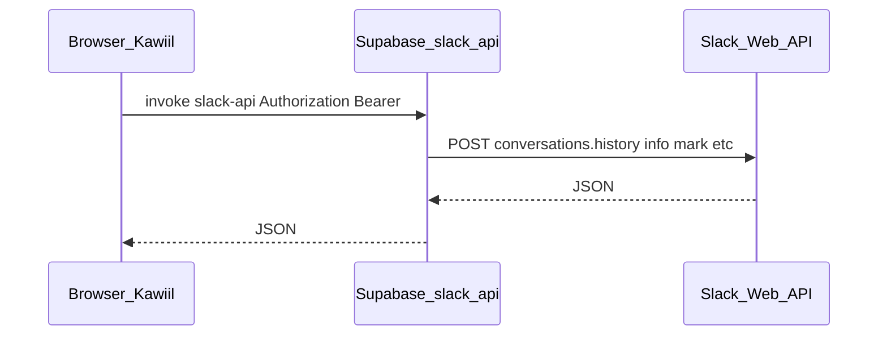

# Comunicación Slack en Kawiil: diagnóstico y sincronización

Documentación operativa para la vista **Comunicación** (integración Slack vía Edge Function `slack-api`). Complementa [slack-archivos-comunicacion.md](./slack-archivos-comunicacion.md) (adjuntos y tiempo casi real).

## Dónde corre la lógica

- El navegador llama a **Supabase Edge** → función **`slack-api`** con JWT del usuario de Kawiil (la función valida sesión y usa el **Slack user token** guardado para ese usuario).
- **No** depende de la máquina donde compilas el frontend: en producción es una SPA estática + Edge en Supabase.

## Carga del historial y mensaje «Slack está tardando…»

- El aviso **no** es necesariamente un fallo: tras **~24 s** esperando la primera página del historial, la UI muestra una pista y «Reintentar» ([`Comunicacion.tsx`](../src/pages/Comunicacion.tsx), [`SlackMessageList.tsx`](../src/components/slack/SlackMessageList.tsx)).
- La primera petición puede durar hasta **~110–118 s** en el cliente (`SLACK_HISTORY_*`) y la Edge acumula hasta **~115 s** de presupuesto para `conversations.history` con recuperaciones (`join` / `open`), con **25 s** por llamada HTTP a Slack ([`slack-api/index.ts`](../supabase/functions/slack-api/index.ts)).
- Canales con historial muy grande o recuperaciones (`not_in_channel`) suelen tardar más sin indicar problema de «servidor propio».

## Checklist rápido si no carga o falla

1. **Permisos Slack** — [api.slack.com](https://api.slack.com/apps) → tu app → **OAuth & Permissions** → **User Token Scopes**. Tras cambiar scopes, en Comunicación usar **«Actualizar permisos Slack»**.
2. **Secret `SLACK_USER_SCOPES` en Supabase** — Si existe, debe incluir todos los scopes necesarios o eliminarse para usar los predeterminados del código.
3. **Proyecto correcto** — `VITE_SUPABASE_URL` / deploy de **`slack-api`** en el mismo proyecto Supabase que usa la app ([reglas del repo](../.cursor/rules/supabase-config.mdc)).
4. **Red / VPN** — Firewall o proxy bloqueando `*.supabase.co` o `slack.com`.
5. **Navegador** — DevTools → Red: respuesta de `slack-api`, cuerpo `ok: false` y `error` (p. ej. `not_in_channel`, `ratelimited`, `slack_timeout`).
6. **Logs Edge** — Supabase → Edge Functions → `slack-api`: líneas como `[slack-api] conversations.history channel=… ok=… ms=… recovery_steps=…`.

Errores legibles en cliente: [`formatSlackHistoryLoadError`](../src/lib/slackApi.ts).

## Notificaciones Slack (`slack-events`) y `SLACK_BOT_TOKEN`

- La Edge **`slack-events`** inserta títulos y cuerpos en [`notifications`](../supabase/functions/slack-events/index.ts) usando `users.info` / `conversations.info`.
- **Sin `SLACK_BOT_TOKEN`**, el código usa el **token de usuario** del remitente (si tiene cuenta Kawiil enlazada) o el primer `access_token` del workspace en `user_slack_connections`, para seguir resolviendo nombres en títulos y menciones en el preview.
- **`SLACK_BOT_TOKEN`** sigue siendo recomendable para miembros de canal vía `conversations.members` donde el bot está invitado y para cargas más predecibles; no es el único medio para mostrar «quién escribió» en el texto de la notificación.

## Tiempo casi real

Kawiil **no** usa el socket RTM de Slack. Los mensajes de otros aparecen al enfocar la ventana, refetch periódico (~90 s con pestaña visible), o tras acciones locales; ver [slack-archivos-comunicacion.md § Comunicación en tiempo casi real](./slack-archivos-comunicacion.md).

## Sincronización «mensaje visto» (lectura)

### Kawiil → Slack

- Al tener un canal abierto y conocer el último `ts` del historial cargado, se llama **`conversations.mark`** vía `slack-api` ([`markSlackConversationRead`](../src/lib/slackApi.ts)): Slack marca la conversación como leída para el usuario conectado.
- **Matiz:** el marcado usa el último mensaje del **historial ya cargado**, no la posición exacta del scroll hasta el final del hilo.

### Slack → Kawiil

- **`conversations.info`** devuelve el objeto de canal; Slack incluye **`last_read`** (último mensaje considerado leído por ese usuario).
- Kawiil fusiona ese valor con el cursor en **`localStorage`** (`kawiil-slack-read-ts-{userId}`): si Slack va por delante (leyeron en el cliente Slack), se actualiza el cursor para badges/snapshot y el divisor **«Nuevos»** en la lista ([`slackReadCursor.ts`](../src/lib/slackReadCursor.ts), [`Comunicacion.tsx`](../src/pages/Comunicacion.tsx)).
- La reconciliación de no leídos (`useSlackUnreadSync`) sigue limpiando notificaciones cuando Slack reporta cero no leídos; además se refresca **`slack-channel-info`** tras esa reconciliación y al volver a enfocar la ventana, para no depender solo del `staleTime` largo de `conversations.info`.

### Límites

- Sin RTM, la coherencia entre lectura solo en Slack y la UI de Kawiil depende de **polling**, foco de ventana e invalidaciones; puede haber un retardo de hasta el siguiente refetch.

## Código de referencia

| Tema | Archivo |
|------|---------|
| Historial + timeouts cliente | [`src/pages/Comunicacion.tsx`](../src/pages/Comunicacion.tsx) |
| Lista + divisor Nuevos | [`src/components/slack/SlackMessageList.tsx`](../src/components/slack/SlackMessageList.tsx) |
| Cursor local + comparación ts | [`src/lib/slackReadCursor.ts`](../src/lib/slackReadCursor.ts) |
| Snapshot no leídos Slack→Kawiil | [`src/hooks/useSlackUnreadSync.ts`](../src/hooks/useSlackUnreadSync.ts) |
| Edge Slack | [`supabase/functions/slack-api/index.ts`](../supabase/functions/slack-api/index.ts) |
